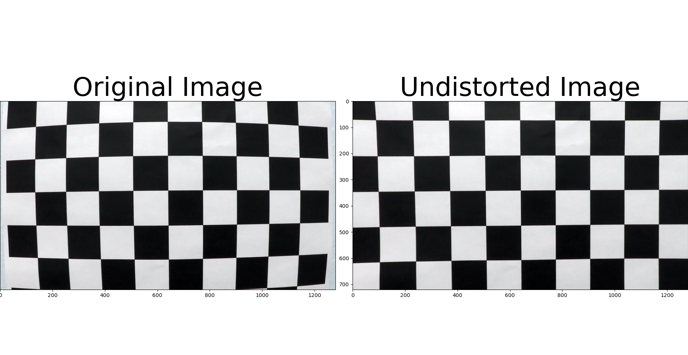
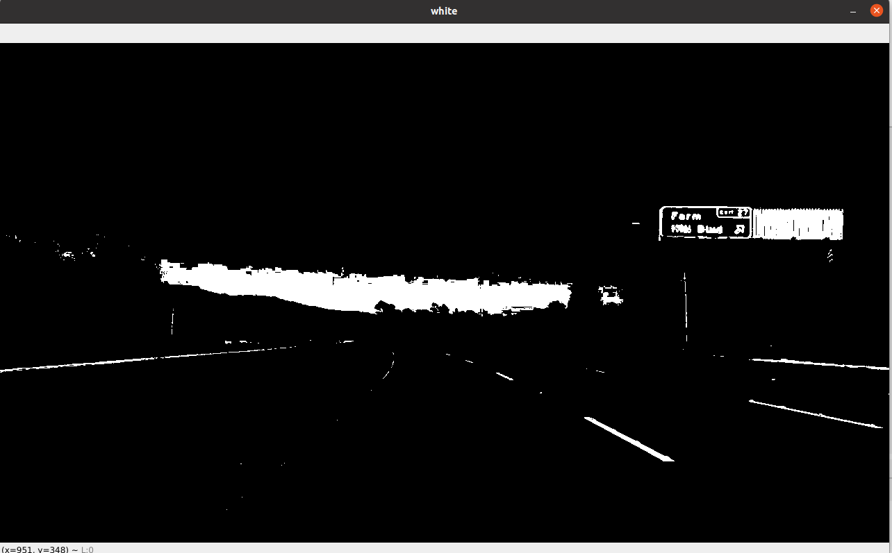
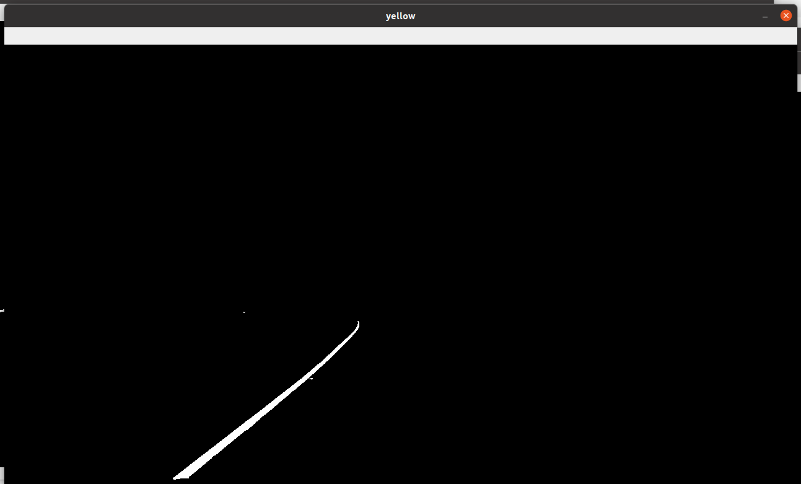
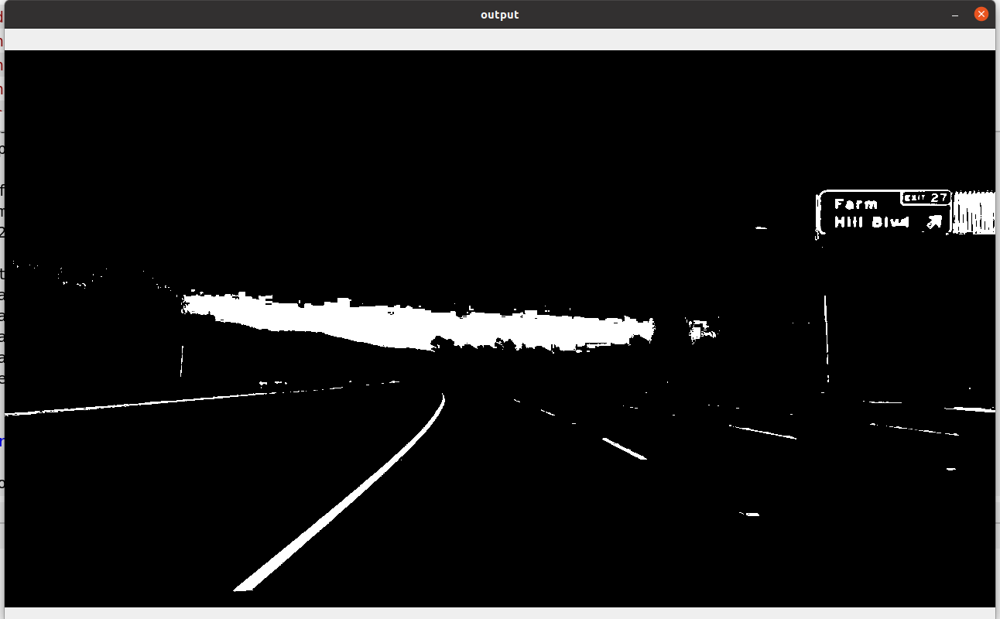
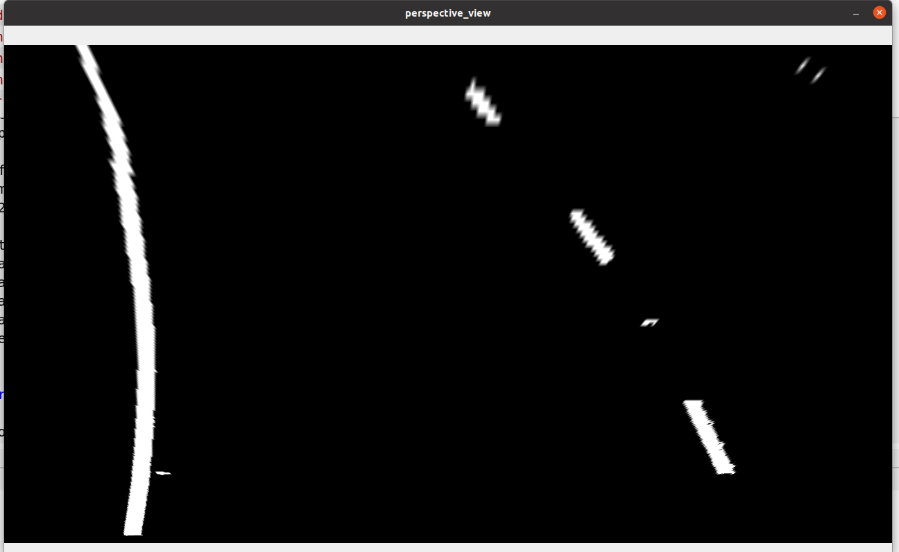
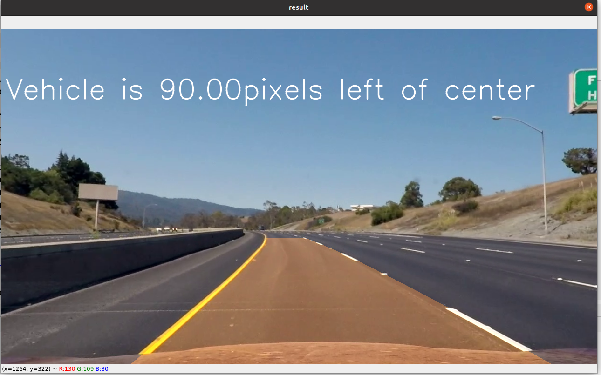

## Advanced Lane Finding
[](http://www.udacity.com/drive)


In this project, your goal is to write a software pipeline to identify the lane boundaries in a video, but the main output or product we want you to create is a detailed writeup of the project.  Check out the [writeup template](https://github.com/udacity/CarND-Advanced-Lane-Lines/blob/master/writeup_template.md) for this project and use it as a starting point for creating your own writeup.  

Creating a great writeup:
---
A great writeup should include the rubric points as well as your description of how you addressed each point.  You should include a detailed description of the code used in each step (with line-number references and code snippets where necessary), and links to other supporting documents or external references.  You should include images in your writeup to demonstrate how your code works with examples.  

All that said, please be concise!  We're not looking for you to write a book here, just a brief description of how you passed each rubric point, and references to the relevant code :). 

You're not required to use markdown for your writeup.  If you use another method please just submit a pdf of your writeup.

The images for camera calibration are stored in the folder called `camera_cal`.  The images in `test_images` are for testing your pipeline on single frames.  If you want to extract more test images from the videos, you can simply use an image writing method like `cv2.imwrite()`, i.e., you can read the video in frame by frame as usual, and for frames you want to save for later you can write to an image file.  

To help the reviewer examine your work, please save examples of the output from each stage of your pipeline in the folder called `output_images`, and include a description in your writeup for the project of what each image shows.    The video called `project_video.mp4` is the video your pipeline should work well on.  

The `challenge_video.mp4` video is an extra (and optional) challenge for you if you want to test your pipeline under somewhat trickier conditions.  The `harder_challenge.mp4` video is another optional challenge and is brutal!

If you're feeling ambitious (again, totally optional though), don't stop there!  We encourage you to go out and take video of your own, calibrate your camera and show us how you would implement this project from scratch!


**Advanced Lane Finding Project**

The goals / steps of this project are the following:

* Compute the camera calibration matrix and distortion coefficients given a set of chessboard images.
* Apply a distortion correction to raw images.
* Use color transforms, gradients, etc., to create a thresholded binary image.
* Apply a perspective transform to rectify binary image ("birds-eye view").
* Detect lane pixels and fit to find the lane boundary.
* Determine the curvature of the lane and vehicle position with respect to center.
* Warp the detected lane boundaries back onto the original image.
* Output visual display of the lane boundaries and numerical estimation of lane curvature and vehicle position.


## [Rubric](https://review.udacity.com/#!/rubrics/571/view) Points

### Here I will consider the rubric points individually and describe how I addressed each point in my implementation.  

### Camera Calibration

#### 1. Briefly state how you computed the camera matrix and distortion coefficients. Provide an example of a distortion corrected calibration image.

The code for this step is contained in the first code cell of the IPython notebook located in "calibarate  camera.ipynb" .  

I start by preparing "object points", which will be the (x, y, z) coordinates of the chessboard corners in the world. Here I am assuming the chessboard is fixed on the (x, y) plane at z=0, such that the object points are the same for each calibration image.  Thus, `objp` is just a replicated array of coordinates, and `objpoints` will be appended with a copy of it every time I successfully detect all chessboard corners in a test image.  `imgpoints` will be appended with the (x, y) pixel position of each of the corners in the image plane with each successful chessboard detection.  

I then used the output `objpoints` and `imgpoints` to compute the camera calibration and distortion coefficients using the `cv2.calibrateCamera()` function.  I applied this distortion correction to the test image using the `cv2.undistort()` function and obtained this result: 



for testing the cam calibartion you can use the code in the second cell.

### Pipeline (single images)
* feed the pipeline with the Image using Lane_detect.feed_image method.
* Use color transforms, gradients, etc., to create a thresholded binary image using Lane_detect.binary method.
* Apply a perspective transform to rectify binary image ("birds-eye view") using Lane_detect.perspective_view method.
* Detect lane pixels and fit to find the lane boundary using Lane_detect.find_lane method.
* Output visual display of the lane boundaries and numerical estimation of lane curvature and vehicle position using Lane_detect.draw method.

#### 1.distortion-corrected image.

in the feed_image method we get the new frame from the camera and apply the undistort method which is provided from open cv lib.

#### 2. color transforms methods to create a thresholded binary image.  

In the binary method,I used a combination of color thresholds to generate a binary image.

First I detect white color using HLS threshold using white_thresh method.

 And the same process to detect the Yellow color using yellow_thresh method 

After that I merge the Two binaries to generate the Binary output


#### 3.  performed  perspective transform .

The code for my perspective transform includes a function called `perspective_view()`. I chose the hardcode the source and destination points in the following manner:

```python
src = np.float32(
            [[200, self.h_-1],
            [565, 450],
            [722, 450],
            [1100, self.h_-1]
            ])
dst = np.float32(
            [[100, self.h_-1],
            [100, 0],
            [1000, 0],
            [1000, self.h_-1]
            ])
```

This resulted in the following source and destination points:


I verified that my perspective transform was working as expected by drawing the `src` and `dst` points onto a test image and its warped counterpart to verify that the lines appear parallel in the warped image and you can find the result for the binary ouput as below:




#### 4.  identified lane-line pixels and fit their positions with a polynomial

In find_lane Method I get the Lane base by search on the x coordeneate the have the peack number of points using the histogram.
using a sliding Window I adjust the new X value mean and append the lane point In each Window.
After Sliding all of the Windows , I get the Lane curve equation using the np.polyfit from the Second degree.


#### 5. Describe how (and identify where in your code) you calculated the radius of curvature of the lane and the position of the vehicle with respect to center.

I did this in lines # through # in my code in `my_other_file.py`

#### 6. result plotted back down onto the road such that the lane area is identified clearly.

I implemented this step in draw method where I blend the Lane detected after retransform It back using The Inverse conversion Matrex with the orignal Frame.  Here is an example of my result on a test image:



---

### Pipeline (video)

#### 1. Provide a link to your final video output.  

Here's a [link to my video result](output_images/Lande_detection_result.mp4)

---

### Discussion

#### 1. Briefly discuss any problems / issues you faced in your implementation of this project.  Where will your pipeline likely fail?  What could you do to make it more robust?

Here I'll talk about the approach I took,
One big Issue if the 1 lane dissapre maye due to taking a curveature and I thinks I should detect that and used a vertiual lane based on the old observation.    
The fixed ROI can't be good with curves with small reduis like the one in the harder_challenge_video.  
If there is a near by object which is White or Yellow
